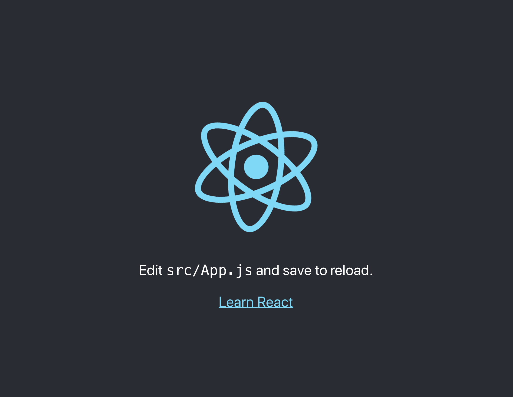

# Create the boilerplate React App

The first step is to create a boiler plate react app. React provides a command line 
tool: 'Create react App' that will do this for you.

Follow the instructions [here](https://github.com/facebook/create-react-app).

tl;dr run the commands below in the terminal:

```
npx create-react-app psswrdz-app
cd psswrdz-app
npm start
```

The first command above may take a few seconds to install all of file dependancies. 

The last command may take a few seconds to start the app for the first time. 

When the app is running it should open in a browser and look like this: 



The project is now running on `localhost:3000`. This local server is 
for development. 

Editing files in the project should trigger the local server to update. In this
way you can see the latest changes immediately in the browser. 

When your project is ready for production run: `npm run build`. This command 
builds a production version of the project. This production version doesn't 
require the NPM dependencies, these are 'bundled' into a single js file. 

Try it: `npm run build`

This should create new folder named: 'build'. This folder contains 
the complete project with all required source code. 

When your project is complete you'll run `npm run build` and 
deploy the content of the build folder to your public web 
server. 

## Tour the React App source code

The boilerplate project contains a few files that are arranged in 
folders. 

You'll do your work in the `src` folder. This folder contains
all of the React Components. 

All of the components you create must be stored in the 'src' folder. 

`index.js` defines `ReactDOM.render()` this loads and 
displays the `App` component. This is the entry point
for a react app. You won't need to edit this file. 

`App.js` contains the root component for the app. At the
moment this file defines everything you see when you 
run the default app. 

You will break your app into components and import these 
components into the App component. Each new component will 
be defined in a new file in the `src` directory. 

## Resources 

- https://github.com/facebook/create-react-app


