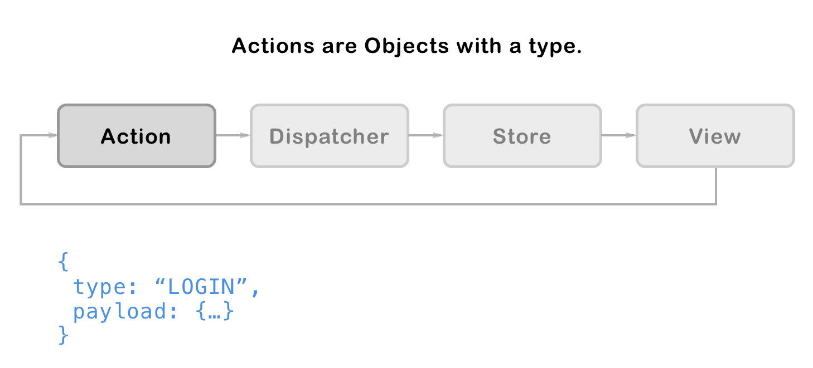
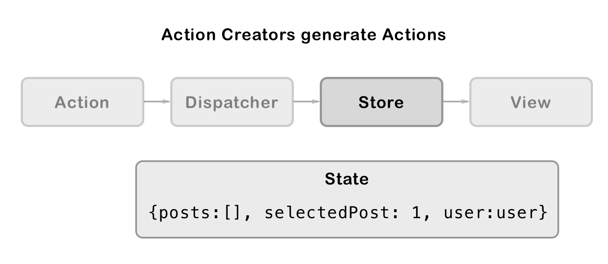

# React Redux

React Redux is a library that connects Redux to your React 
applications. 

The React Redux library adds methods and React Components to 
make the job connecting React to Redux easier. 

Flux -> Redux -> Rect-Redux -> React

## Redux - Actions and Reducers

Redux stores Application state as a single JavaScript Object. We will 
call this the Store. 

The Store is updated by a function called a Reducer. The reducer 
takes the current Application state and an action as parameters
and returns a **new** state Object. 

Actions are JavaScript Objects that describe a change that should be 
made to state. 

A view might generate an Action which is sent to the dispatcher.
An Action Object has a type and a payload. Type is always a 
string. Payload can be any data the reducer might need to 
implement the action. 

Best practice says that we will use a function to generate Actions. 
An Action Creator is a function that generates action Objects. 

The dispatch calls the reducer with the current state and the Action. 
Reducers return new state after making any changes. 

The store is a JavaScript Object that holds application data. 

After the store is updated data is passed to views. React Redux 
passes data to views as props. 

## Implement React Redux

The following steps implement React Redux in a react project. 

### Add Redux

Import redux into your project. 

`npm i --save redux;`

This adds Redux as a dependancy to the project.

The redux package adds some methods used by redux that set up and manage the store. 

- createStore()
- combineReducers()

### Add react-redux 

Add react-redux as a dependancy. This is 'glue' that connects
Redux with React

`npm i --save react-redux;`

React Redux adds some methods and components that make it easy for Redux and React to work together. 

- Provider

Provider is a Component that provides access to the Redux store to 
it's child components. 

React Redux also provides some hooks that can be used to send actions and retrieve the store.

- useSelector - connects your components to the store use this to retrieve values fro the store. 
- useDispatch - returns a reference to the dispatcher. Use this when you need to send and action to update the store. 

## Resources

